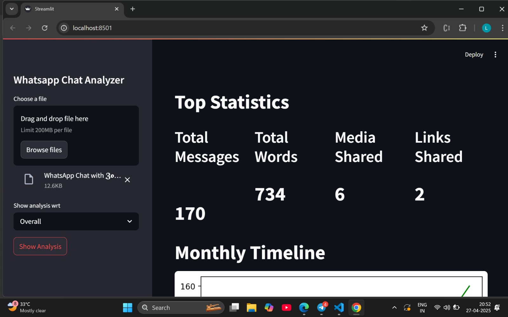
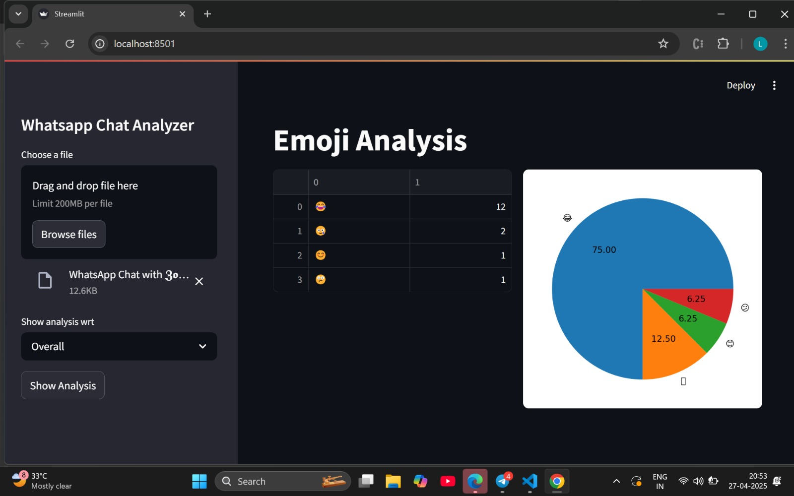
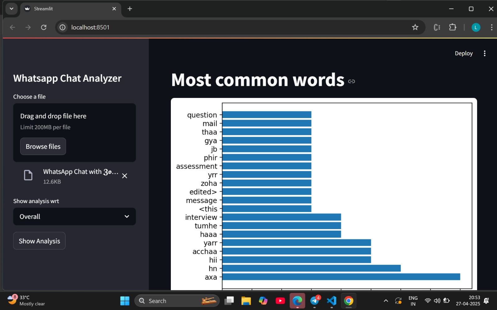
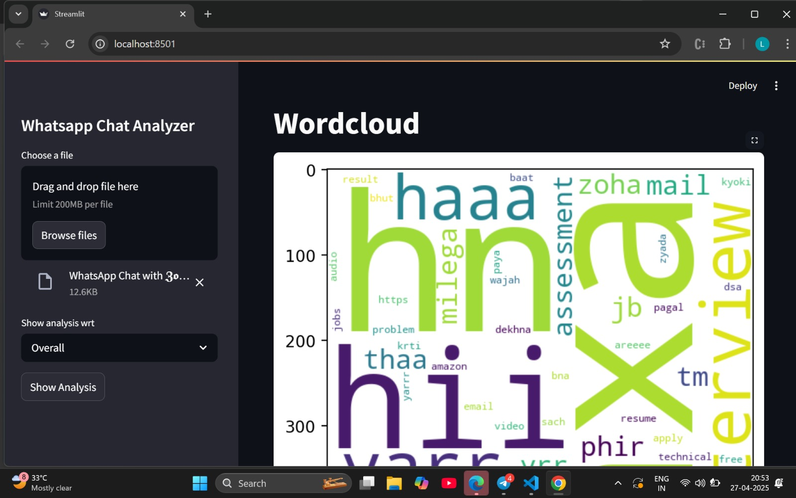
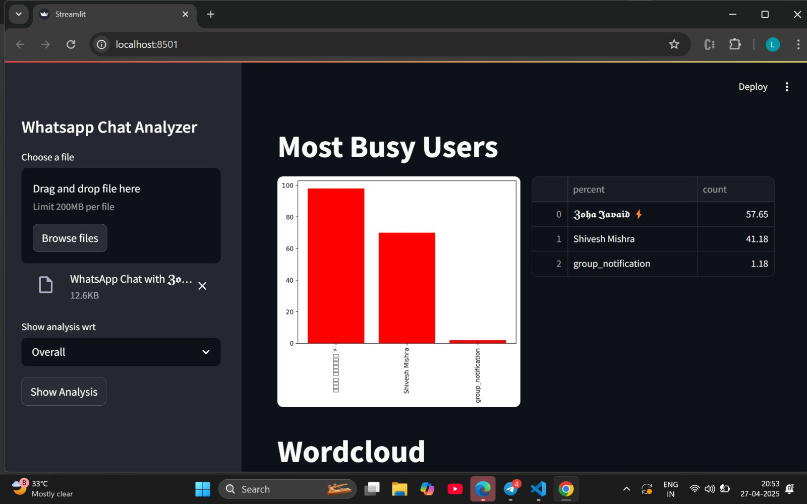
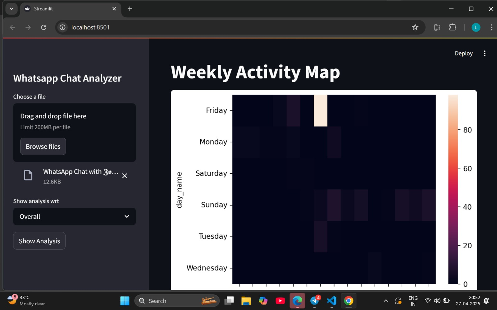
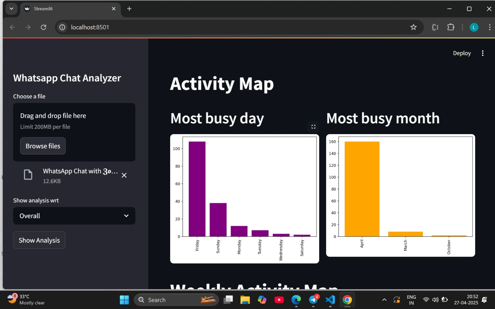

# WhatsApp Chat Analysis 📈

This project analyzes WhatsApp chat exports to provide meaningful insights like message counts, media sharing, emoji usage, and more!

---

## Features ✨
- Upload and parse WhatsApp chat text files.
- Visualize message trends over time.
- Identify most active users and peak chatting hours.
- Emoji and word usage analysis.
- Media, link, and word statistics.

---

## How to Run 🚀
1. Clone the repository:
  
   git clone https://github.com/mshiveshm/Whatsapp-chat-analysis.git
   
2. Install the required libraries:
  
   pip install -r requirements.txt
   
3. Run the app:
  
   streamlit run app.py
   
---

## Output Screenshots 📸

### Screenshot 1

### Screenshot 2

### Screenshot 3

### Screenshot 4

### Screenshot 5

### Screenshot 6

### Screenshot 7

---

## Tech Stack 🛠
- Python
- Streamlit
- Pandas
- Matplotlib / Seaborn

---

## Author 👩‍💻
- [Shivesh Mishra](https://github.com/mshiveshm)
